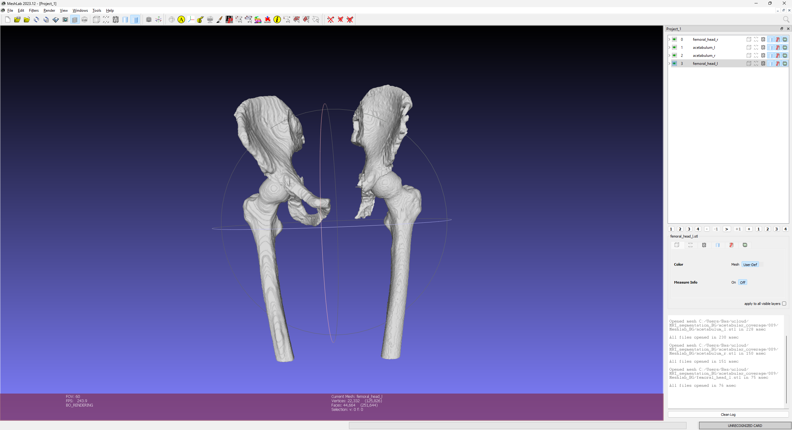
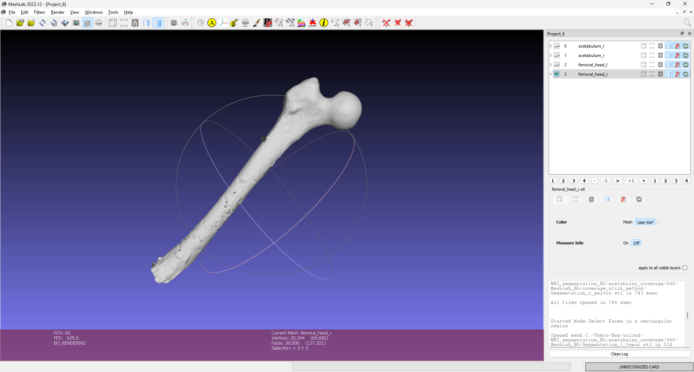
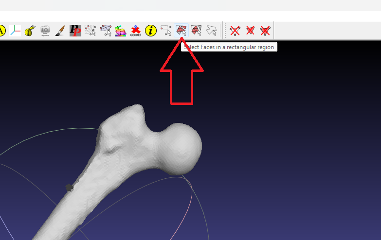
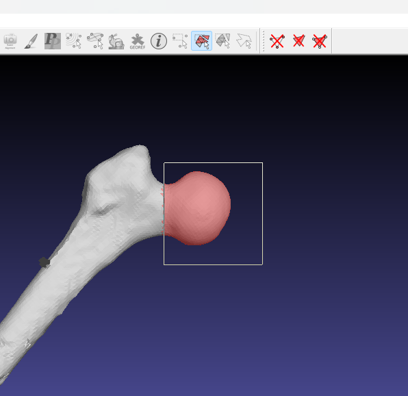
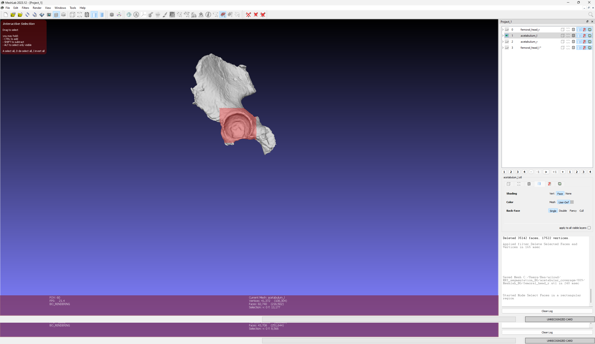
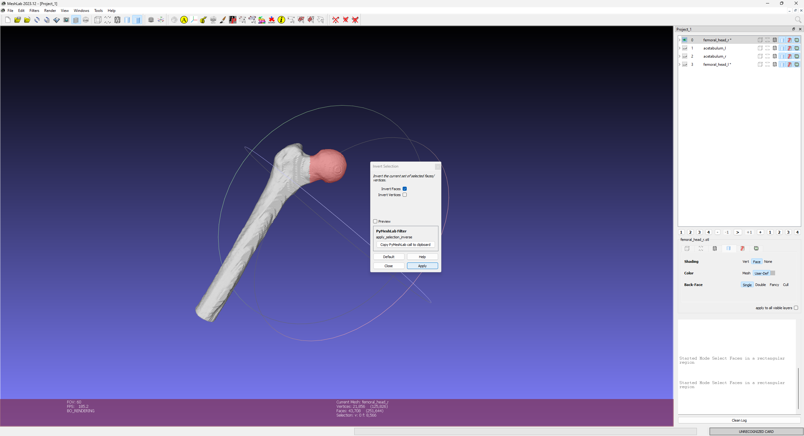
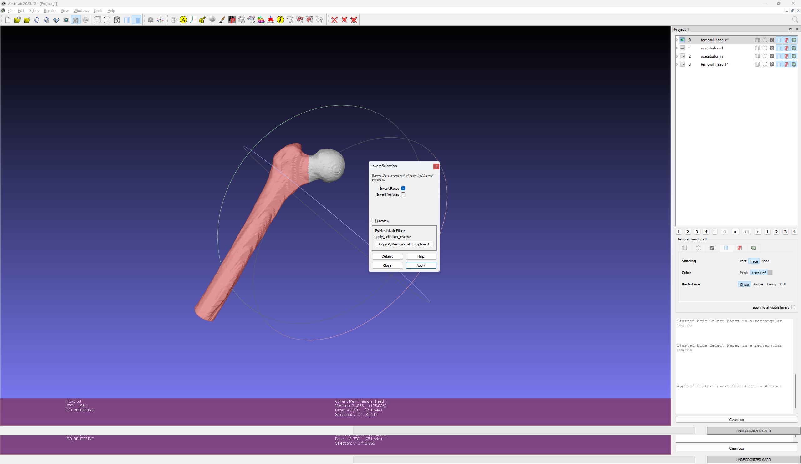
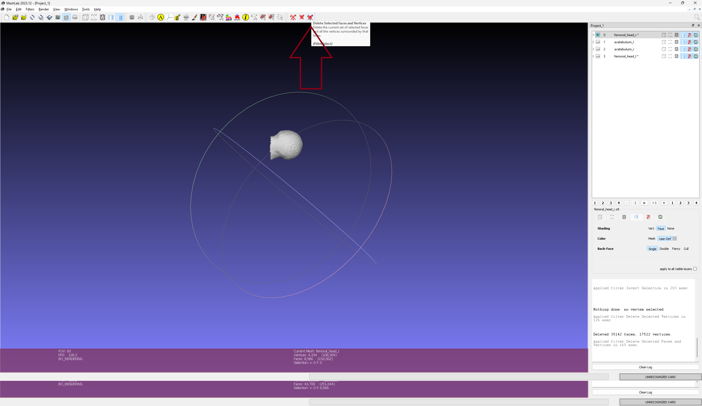
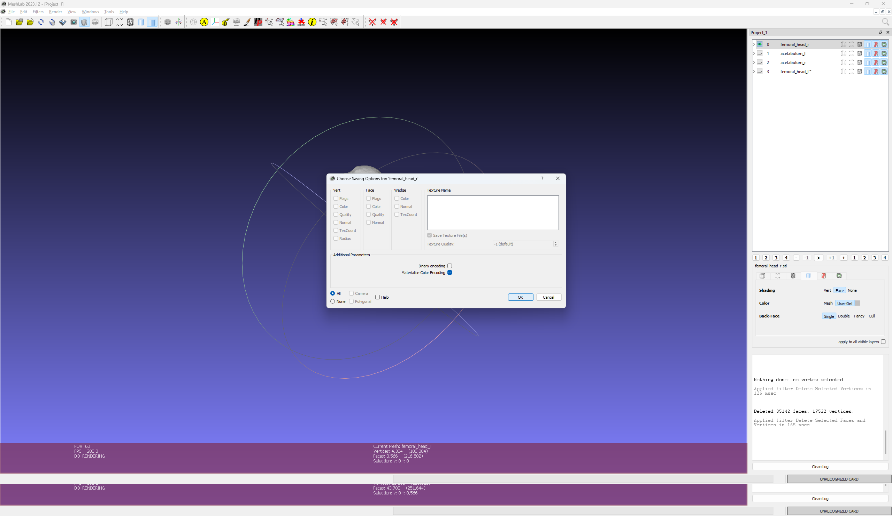

## Slicer 


## Python
Use .\remesh.py for remeshing .stl files

```python
    import msk_modelling_python as msk

    msk_modelling_python.src.mri.hip_project.remesh
    subjects_to_run = []
    mode = "manual" # "manual", "semi-auto" or "batch"
```

## 3. Mesh lab
Cut meshes in mesh lab
### 3.1 Drag and drop meshes

### 3.2 Select only one mesh 

### 3.3 Select faces (repeat both Femur and Acetabulum) 
#####  3.3.1 until narrrowest point of the neck


#####  3.3.2 acetabulum select only visible (hold ALT and select)

#### 3.4 Invert selection (CTRL + Shift + I)



### 3.5 Delete selected faces 


### 3.6 Export .stl file (CRLT + E) and untick binary encoding


### Invert Faces
Instructions on how to invert faces in MeshLab.

### Export Binary STL
Instructions on how to export a binary STL file in MeshLab.